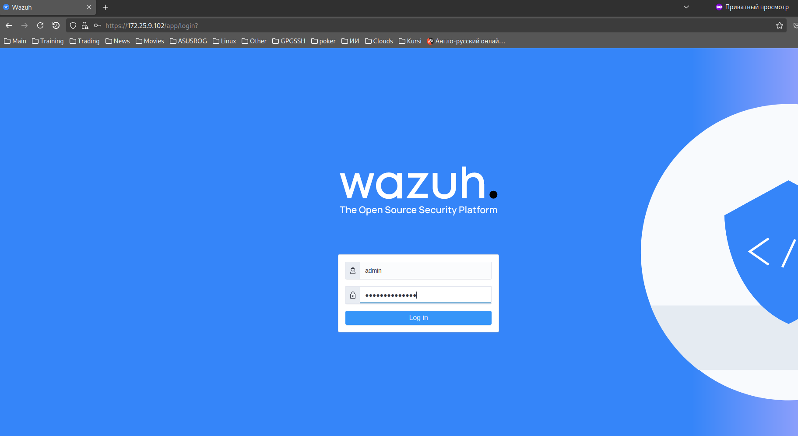
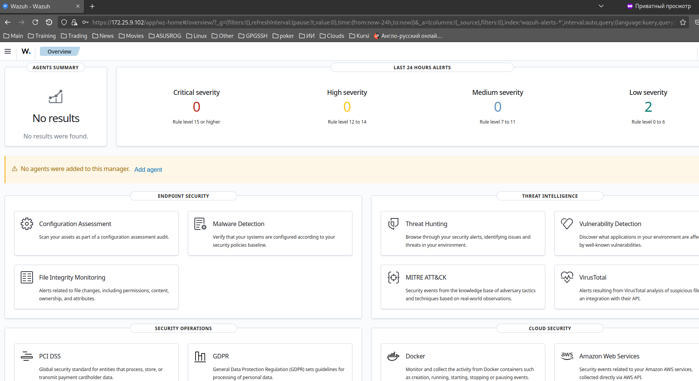
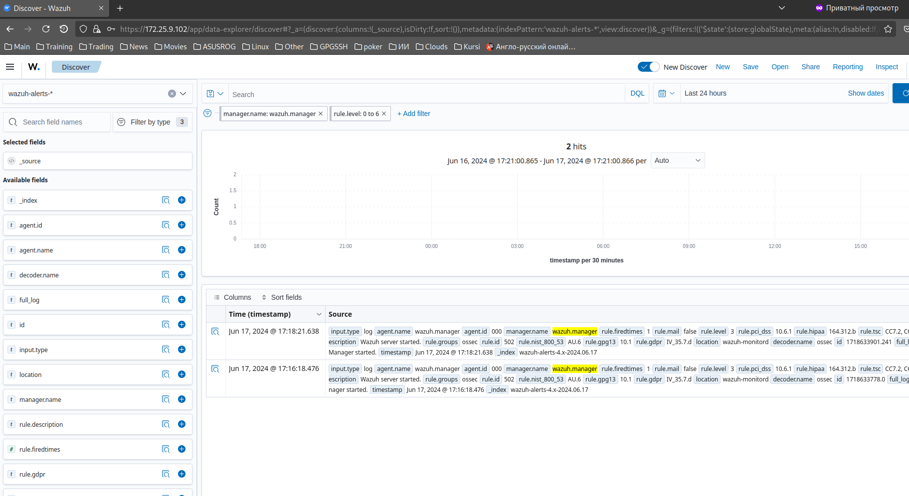

# Diplom Project TeachMeSkills

- [Diplom Project TeachMeSkills](#diplom-project-teachmeskills)
  * [Расследование инцидентов](#------------------------)
  * [Создать скрипт на любом языке, который в информативном виде будет запускать скрипт с установкой:](#------------------------------------------------------------------------------------------------)
  * [Автоматизировать процесс проверки url через virustotal](#----------------------------------url-------virustotal)
  * [Вы обнаружили уязвимость CVE-2021-41773 на вашем web сервере](#-------------------------cve-2021-41773----------web--------)
  * [Отправить фишинговое письмо](#---------------------------)
  * [** Установить SIEM систему (на ваше усмотрение Wazuh, ELK\EFK, cloud splunk)](#--------------siem-----------------------------wazuh--elk-efk--cloud-splunk-)

<small><i><a href='http://ecotrust-canada.github.io/markdown-toc/'>Table of contents generated with markdown-toc</a></i></small>

## Расследование инцидентов

> Изучить логи и примеры инцидентов, дать подробные ответы на данные вопросы:

[Link to SOC Questions](docs/rassledovanie.md)

Ответы:

> [Link to SOC Answers](docs/rassledovanie.md)

## Создать скрипт на любом языке, который в информативном виде будет запускать скрипт с установкой:

* `AVML` - создание дампа оперативной памяти
* `Volatility` - фреймворк для работы с артефактами форензики
* `dwarf2json` - создание symbol table для кастомного ядра linux
* Сделает снимок Debug kernel для symbol table

Ответы:

> [Link to automatization sript](bin/2_avtomatization.sh)

```sh
#!/bin/zsh

# Define colors for echo messages
GREEN='\033[1;32m'
RED='\033[1;31m'
YELLOW='\033[1;33m'
CYAN='\033[1;36m'
NC='\033[0m'  # No Color

# Function to install AVML
install_avml() {
  echo -e "${CYAN}Checking if AVML is installed...${NC}"
  if command -v avml >/dev/null 2>&1; then
    echo -e "${GREEN}AVML is already installed.${NC}"
  else
    echo -e "${YELLOW}Installing AVML...${NC}"
    sudo apt-get update
    sudo apt-get install -y avml || {
      echo -e "${RED}Failed to install AVML via apt. Downloading binary...${NC}"
      wget https://github.com/microsoft/avml/releases/download/v0.14.0/avml -O avml
      chmod +x avml
      sudo mv avml /usr/local/bin/
    }
    echo -e "${GREEN}AVML installation completed.${NC}"
  fi
}

# Function to install Volatility
install_volatility() {
  echo -e "${CYAN}Checking if Volatility is installed...${NC}"
  if command -v volatility >/dev/null 2>&1; then
    echo -e "${GREEN}Volatility is already installed.${NC}"
  else
    echo -e "${YELLOW}Installing Volatility...${NC}"
    sudo apt-get install -y volatility
    echo -e "${GREEN}Volatility installation completed.${NC}"
  fi
}

# Function to install dwarf2json
install_dwarf2json() {
  echo -e "${CYAN}Checking if dwarf2json is installed...${NC}"
  if command -v dwarf2json >/dev/null 2>&1; then
    echo -e "${GREEN}dwarf2json is already installed.${NC}"
  else
    echo -e "${YELLOW}Installing dwarf2json...${NC}"
    sudo apt-get install -y dwarf2json
    echo -e "${GREEN}dwarf2json installation completed.${NC}"
  fi
}

# Function to create memory dump using AVML
create_memory_dump() {
  echo -e "${CYAN}Creating memory dump with AVML...${NC}"
  sudo avml -o dump.raw && echo -e "${GREEN}Memory dump created successfully.${NC}" || echo -e "${RED}Failed to create memory dump.${NC}"
}

# Function to analyze memory with Volatility
analyze_memory() {
  echo -e "${CYAN}Analyzing memory dump with Volatility...${NC}"
  sudo volatility -f dump.raw --profile=Linux --dump-dir=/tmp/volatility && \
  echo -e "${GREEN}Memory analysis completed successfully.${NC}" || \
  echo -e "${RED}Memory analysis failed.${NC}"
}

# Function to create symbol table with dwarf2json
create_symbol_table() {
  local kernel_path="/path/to/custom/kernel/vmlinux"
  echo -e "${CYAN}Creating symbol table with dwarf2json...${NC}"
  sudo dwarf2json -o symbol_table.json "${kernel_path}" && \
  echo -e "${GREEN}Symbol table created successfully.${NC}" || \
  echo -e "${RED}Failed to create symbol table.${NC}"
}

# Function to take debug snapshot of kernel
take_debug_snapshot() {
  local kernel_path="/path/to/custom/kernel/vmlinux"
  echo -e "${CYAN}Taking debug snapshot of kernel...${NC}"
  sudo gdb -ex "set logging file debug_kernel.log" \
           -ex "set logging on" \
           -ex "target remote :1234" \
           -ex "continue" "${kernel_path}" && \
  echo -e "${GREEN}Debug snapshot completed successfully.${NC}" || \
  echo -e "${RED}Failed to take debug snapshot.${NC}"
}

# Execute functions
install_avml
install_volatility
install_dwarf2json
create_memory_dump
analyze_memory
create_symbol_table
take_debug_snapshot

```

## Автоматизировать процесс проверки url через virustotal

> Напишите небольшой скрипт для автоматизированной проверки url. Можно использовать любой язык программирования

Ответы:

> [Link to virustotal check script](bin/3_check-url.py)

```py
import requests
import json

# API ключ VirusTotal
api_key = "ВСТАВЬТЕ_СВОЙ_API_КЛЮЧ"

# URL для проверки
url = input("Введите URL для проверки: ")

# Отправка запроса на VirusTotal
headers = {
    "Accept": "application/json",
    "x-apikey": api_key
}
params = {
    "url": url
}
response = requests.post("https://www.virustotal.com/api/v3/urls", headers=headers, params=params)

# Проверка статуса ответа
if response.status_code == 200:
    # Получение данных из ответа
    data = json.loads(response.text)
    # Вывод результатов проверки
    print("Результаты проверки:")
    print("URL:", data["data"]["id"])
    print("Статус:", data["data"]["attributes"]["status"])
    print("Последнее обновление:", data["data"]["attributes"]["last_analysis_stats"])
    print("Результаты анализа:")
    for engine, result in data["data"]["attributes"]["last_analysis_results"].items():
        print(engine, ":", result["category"])
else:
    print("Ошибка:", response.status_code)


```

## Вы обнаружили уязвимость CVE-2021-41773 на вашем web сервере

> Вам необходимо создать задачу для IT по её устранению. Что нужно будет сделать специалисту, чтобы исправить эту уязвимость? Напишите plabook для специалиста SOC L1

[Link to CVE-2021-41773](https://nvd.nist.gov/vuln/detail/CVE-2021-41773)

Ответы:

> [Link CVE](docs/cve.md)

## Отправить фишинговое письмо

* Установка setoolkit на ubuntu
* Отправьте мне письмо на адрес:`smilovesmirnov@gmail.com`
* от имени Teachmeskills с адресом отправителя `info@teachmeskills.com`
* В письме пришлите ссылку, на форму - копию страницы Zoom, где хранятся видео с занятий (https://us06web.zoom.us/signin#/login),
* код которой изменен таким образом, чтобы вы смогли получить введенный мной в форму флаг.
* В тексте письма укажите своё имя и фамилию - для уточнения кто выполнил задание
* p.s. Нужно зарегистрироваться в облаке, для получения белого ip
* Для отправки письма, можете использовать [emkei.cz](https://emkei.cz)

Ответы:

> [Link to exploit website](https://)

## ** Установить SIEM систему (на ваше усмотрение Wazuh, ELK\EFK, cloud splunk)

* Настроить логирование и отправку windows 10 логов
* Настроить логирование и отправку linux syslog / auditd 

Scrinshots:






