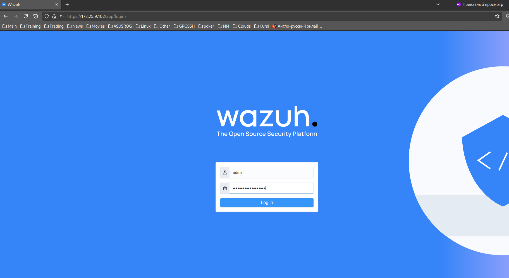

# Diplom Project TeachMeSkills

- [Diplom Project TeachMeSkills](#diplom-project-teachmeskills)
  * [Расследование инцидентов](#------------------------)
  * [Создать скрипт на любом языке, который в информативном виде будет запускать скрипт с установкой:](#------------------------------------------------------------------------------------------------)
  * [Автоматизировать процесс проверки url через virustotal](#----------------------------------url-------virustotal)
  * [Вы обнаружили уязвимость CVE-2021-41773 на вашем web сервере](#-------------------------cve-2021-41773----------web--------)
  * [Отправить фишинговое письмо](#---------------------------)
  * [** Установить SIEM систему (на ваше усмотрение Wazuh, ELK\EFK, cloud splunk)](#--------------siem-----------------------------wazuh--elk-efk--cloud-splunk-)

<small><i><a href='http://ecotrust-canada.github.io/markdown-toc/'>Table of contents generated with markdown-toc</a></i></small>

## Расследование инцидентов

> Изучить логи и примеры инцидентов, дать подробные ответы на данные вопросы:

[Link to SOC Questions](docs/rassledovanie.md)

Ответы:

> [Link to SOC Answers](docs/rassledovanie.md)

## Создать скрипт на любом языке, который в информативном виде будет запускать скрипт с установкой:

* `AVML` - создание дампа оперативной памяти
* `Volatility` - фреймворк для работы с артефактами форензики
* `dwarf2json` - создание symbol table для кастомного ядра linux
* Сделает снимок Debug kernel для symbol table

Ответы:

> [Link to automatization sript](bin/2_avtomatization.sh)

```sh
#!/bin/bash

# Установка необходимых инструментов
echo "Установка AVML..."
sudo apt-get install -y avml

echo "Установка Volatility..."
sudo apt-get install -y volatility

echo "Установка dwarf2json..."
sudo apt-get install -y dwarf2json

# Создание дампа оперативной памяти с помощью AVML
echo "Создание дампа оперативной памяти..."
sudo avml -o dump.raw

# Запуск Volatility для работы с артефактами форензики
echo "Запуск Volatility..."
sudo volatility -f dump.raw --profile=Linux --dump-dir=/tmp/volatility

# Создание symbol table для кастомного ядра Linux с помощью dwarf2json
echo "Создание symbol table..."
sudo dwarf2json -o symbol_table.json /path/to/custom/kernel/vmlinux

# Сделать снимок Debug kernel для symbol table
echo "Сделать снимок Debug kernel..."
sudo gdb -ex "set logging file debug_kernel.log" -ex "set logging on" -ex "target remote :1234" -ex "continue" /path/to/custom/kernel/vmlinux

```

## Автоматизировать процесс проверки url через virustotal

> Напишите небольшой скрипт для автоматизированной проверки url. Можно использовать любой язык программирования

Ответы:

> [Link to virustotal check script](bin/3_check-url.py)

```py
import requests
import json

# API ключ VirusTotal
api_key = "ВСТАВЬТЕ_СВОЙ_API_КЛЮЧ"

# URL для проверки
url = input("Введите URL для проверки: ")

# Отправка запроса на VirusTotal
headers = {
    "Accept": "application/json",
    "x-apikey": api_key
}
params = {
    "url": url
}
response = requests.post("https://www.virustotal.com/api/v3/urls", headers=headers, params=params)

# Проверка статуса ответа
if response.status_code == 200:
    # Получение данных из ответа
    data = json.loads(response.text)
    # Вывод результатов проверки
    print("Результаты проверки:")
    print("URL:", data["data"]["id"])
    print("Статус:", data["data"]["attributes"]["status"])
    print("Последнее обновление:", data["data"]["attributes"]["last_analysis_stats"])
    print("Результаты анализа:")
    for engine, result in data["data"]["attributes"]["last_analysis_results"].items():
        print(engine, ":", result["category"])
else:
    print("Ошибка:", response.status_code)


```

## Вы обнаружили уязвимость CVE-2021-41773 на вашем web сервере

> Вам необходимо создать задачу для IT по её устранению. Что нужно будет сделать специалисту, чтобы исправить эту уязвимость? Напишите plabook для специалиста SOC L1

[Link to CVE-2021-41773](https://nvd.nist.gov/vuln/detail/CVE-2021-41773)

Ответы:

> [Link CVE](docs/cve.md)

## Отправить фишинговое письмо

* Установка setoolkit на ubuntu
* Отправьте мне письмо на адрес:`smilovesmirnov@gmail.com`
* от имени Teachmeskills с адресом отправителя `info@teachmeskills.com`
* В письме пришлите ссылку, на форму - копию страницы Zoom, где хранятся видео с занятий (https://us06web.zoom.us/signin#/login),
* код которой изменен таким образом, чтобы вы смогли получить введенный мной в форму флаг.
* В тексте письма укажите своё имя и фамилию - для уточнения кто выполнил задание
* p.s. Нужно зарегистрироваться в облаке, для получения белого ip
* Для отправки письма, можете использовать [emkei.cz](https://emkei.cz)

Ответы:

> [Link to exploit website](https://)

## ** Установить SIEM систему (на ваше усмотрение Wazuh, ELK\EFK, cloud splunk)

* Настроить логирование и отправку windows 10 логов
* Настроить логирование и отправку linux syslog / auditd 

Scrinshots:




